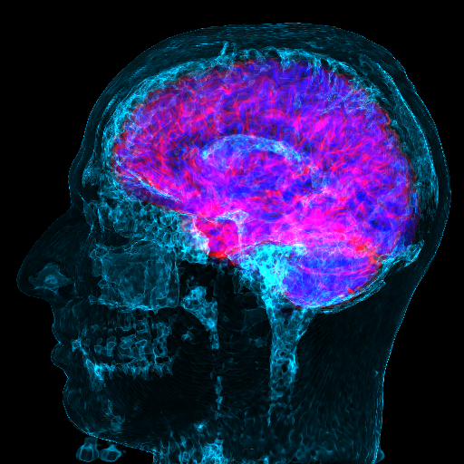
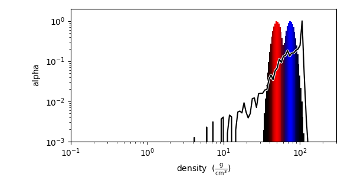
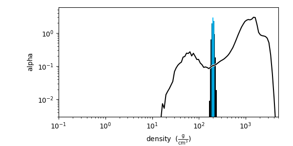

# volume-rendering
A collection of experiments with volume rendering packages.

# yt an astro-physics package
Rendering of my brain with the brain highlighted by two Gaussian color transfer peaks.

The transfer function for the brain is shown below:

While the transfer function of the water image including the skull is shown in this image:

